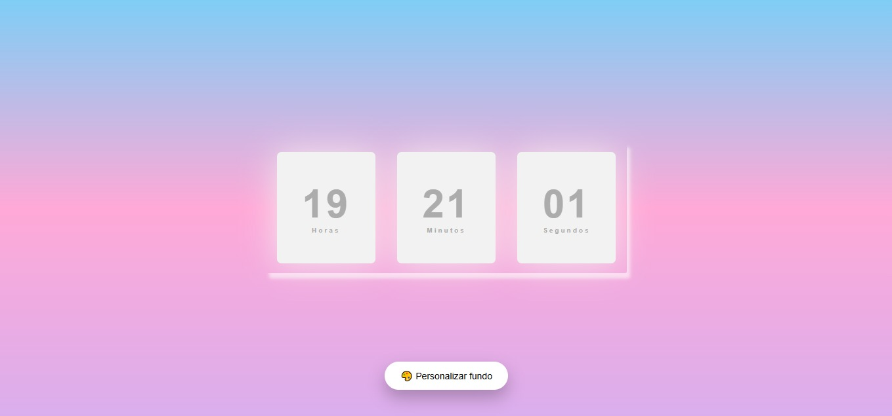

# ⏰ Relógio Digital Personalizável

Projeto Front-End de um relógio digital interativo, desenvolvido com foco em manipulação do DOM, personalização visual e interatividade com o usuário.

## 🖥️ Demonstração
🔗 Site online: https://relogio-digital-pi-bay.vercel.app/  
🔗 Repositório: https://github.com/mellacer/Relogio-Digital

## 📸 Preview


## 🛠️ Tecnologias Utilizadas
- HTML5
- CSS3
- JavaScript

## ⚙️ Funcionalidades
- Exibição de horário em tempo real
- Alteração da cor de fundo ou aplicação de imagem de fundo
- Atualização dinâmica do relógio via JavaScript
- Interface simples e intuitiva

## 📚 Objetivo do Projeto
Projeto desenvolvido com fins educacionais, com o objetivo de praticar:
- Manipulação do DOM
- Atualização de dados em tempo real
- Interatividade com o usuário
- Estilização dinâmica (cores e imagens)
- Integração entre HTML, CSS e JavaScript

## 📱 Responsividade
O layout foi desenvolvido para se adaptar a diferentes tamanhos de tela, mantendo a legibilidade e a usabilidade.

## 🚀 Como executar o projeto
```bash
# Clone o repositório
git clone https://github.com/mellacer/Relogio-Digital

# Acesse a pasta do projeto
cd Relogio-Digital

# Abra o arquivo index.html no navegador
